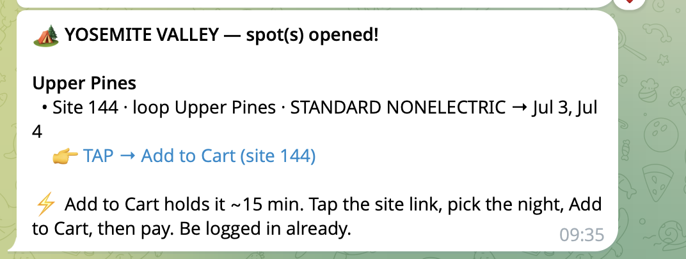

<div align="center">

# 🏕️ open-campsite-watcher

**Snag sold-out campsites the moment someone cancels.**

A tiny, zero-dependency Python watcher that polls [recreation.gov](https://www.recreation.gov)
for cancellations at the campgrounds and exact nights you want — and pings your
phone with a one-tap *Add to Cart* link the second a spot opens.

[](https://www.python.org/)
[](#)
[](LICENSE)
[](#scheduling)

</div>

---

## Why this exists

Yosemite Valley campgrounds (Upper / Lower / North Pines) over a **July 4th
weekend** are some of the hardest reservations in the United States — they sell
out within seconds of the booking window opening, six months out.

I didn't get a spot. So I pointed this watcher at the exact nights I needed and
let it run. Over the following days it caught **cancellations as they happened**
and Telegram-pinged me with a direct booking link. I booked **two nights in
Yosemite Valley on the busiest weekend of the year** — entirely from
cancellations. This repo is that watcher, cleaned up and generalized so you can
do the same for any campground on recreation.gov.

> 🤖 **Bonus:** it ships as a [**Claude skill**](#-claude-skill) — so you can
> set it up and reconfigure it in plain English instead of editing JSON.

<div align="center">

<!-- Drop a screenshot of a real alert here: assets/alert.png -->


<sub>A real cancellation alert — site, nights, and a one-tap Add-to-Cart link.</sub>

</div>

---

## How it works

```
                 every 2 min (launchd / cron)
                          │
                          ▼
         ┌──────────────────────────────────┐
         │        campsite_watcher.py        │
         │                                   │
         │  1. read config.json (where/when) │
         │  2. GET recreation.gov month API  │
         │  3. diff vs state.json            │
         │  4. new opening? → Telegram ping  │
         └──────────────────────────────────┘
                          │
                          ▼
              📲  "Upper Pines · site 106
                   → Jul 3  👉 TAP → Add to Cart"
```

- **Stateful** — remembers what was already open, so you only get pinged on
  *new* cancellations (not the same spot every 2 minutes).
- **Re-pings** a still-open spot up to `max_repeats` times so you don't miss it.
- **Self-expiring** — set `expire_after` to your trip date and it unloads
  itself; no zombie jobs.
- **Multi-month aware** — if your nights straddle two months, it fetches both.

---

## Quickstart

```bash
git clone https://github.com/Pdesolmi/open-campsite-watcher.git
cd open-campsite-watcher

# 1. Configure where & when
cp config.example.json config.json
$EDITOR config.json

# 2. Add your Telegram bot credentials
cp .env.example .env
$EDITOR .env

# 3. Test it once (prints the alert instead of sending)
python3 campsite_watcher.py --dry-run

# 4. Schedule it (see below), then check health anytime
python3 campsite_health.py
```

No `pip install` — it's Python 3.9+ standard library only.

### Finding your campground IDs

Open the campground on recreation.gov. The URL ends in a number:
`recreation.gov/camping/campgrounds/`**`232447`** → that's the ID for
`config.json`. The default config has Yosemite Valley's three Pines
campgrounds ready to go.

---

## Configuration

`config.json`:

| Key | What it does |
|-----|--------------|
| `title` | Label shown in alerts and health output. |
| `campgrounds` | `{ "<recreation.gov id>": "Display Name" }` — one or many. |
| `nights` | The exact check-in dates you need, `["YYYY-MM-DD", ...]`. |
| `expire_after` | ISO timestamp; the watcher stops itself after this. Omit to run forever. |
| `max_repeats` | How many times to re-ping a spot that stays open. Default `3`. |
| `poll_seconds` | Documents your schedule interval (set the real interval in launchd/cron). |
| `launchd_label` | macOS launchd label, used for self-unload + health check. |

Secrets live in `.env` (`TELEGRAM_BOT_TOKEN`, `TELEGRAM_CHAT_ID`). Both `.env`
and `config.json` are gitignored.

---

## Scheduling

### macOS (launchd)

```bash
# edit paths inside the template, then:
cp launchd/com.user.campsite-watcher.plist.example \
   ~/Library/LaunchAgents/com.user.campsite-watcher.plist
launchctl load ~/Library/LaunchAgents/com.user.campsite-watcher.plist
```

### Linux (cron)

```cron
*/2 * * * * /usr/bin/python3 /path/to/open-campsite-watcher/campsite_watcher.py
```

Keep the interval at **2 minutes or slower** — see below.

---

## Responsible use

This tool uses recreation.gov's **public, unauthenticated** availability API —
the same endpoint your browser hits when you view a campground calendar. Please:

- **Poll politely.** 2-minute intervals are plenty; don't hammer it.
- **One config, your trip.** It's built to watch *your* nights, not to scrape
  the whole country.
- It only *notifies* you — **you** still book manually on recreation.gov.

Not affiliated with or endorsed by recreation.gov / the National Park Service.
Provided as-is under the MIT license; you're responsible for your own use.

---

## Prior art

If you want a full-featured, multi-provider tool, check out
[**camply**](https://github.com/juftin/camply) — it supports recreation.gov,
ReserveCalifornia, Yellowstone and more, with many notifier backends. It's
excellent and well-maintained.

`open-campsite-watcher` is deliberately the opposite: **one small, readable
file**, no dependencies, no framework — easy to drop on a Mac, point at one
trip, and forget. I built it because I wanted something I could fully read in
five minutes and run forever. If that's you too, you're in the right place.

---

## License

[MIT](LICENSE) © 2026 Pablo de Solminihac
